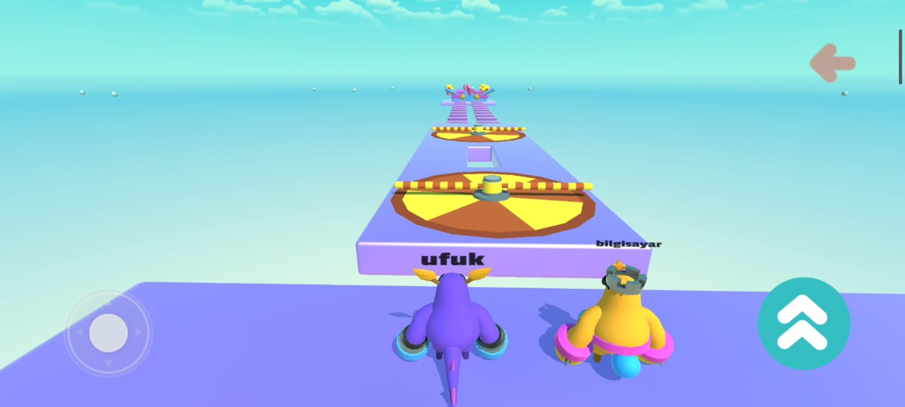
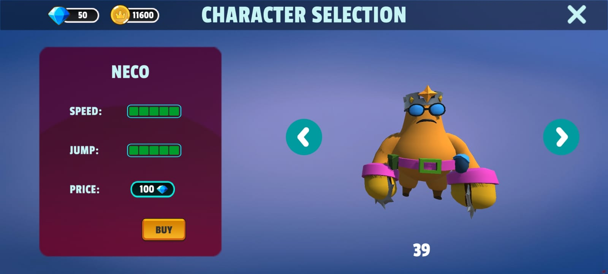
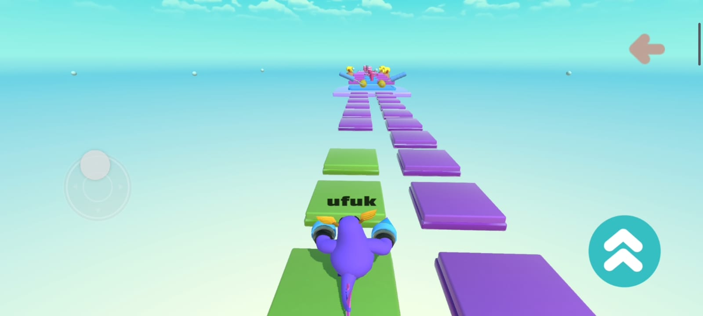
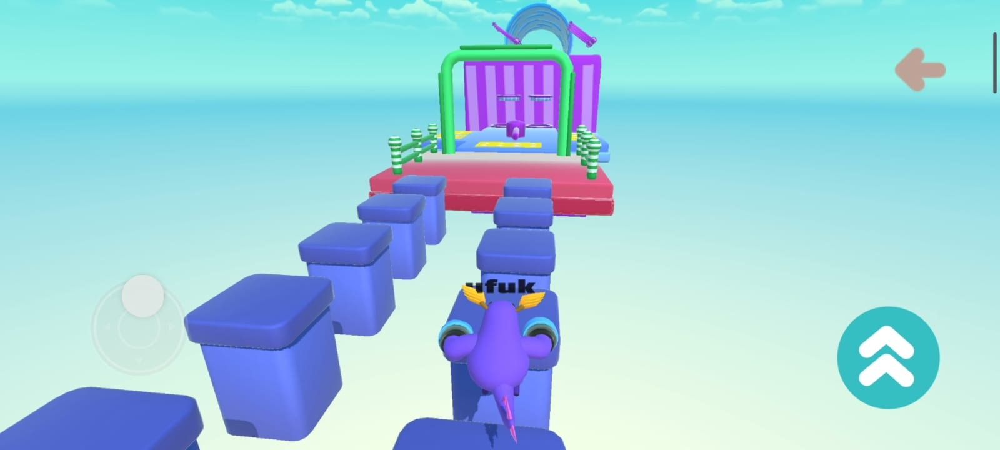
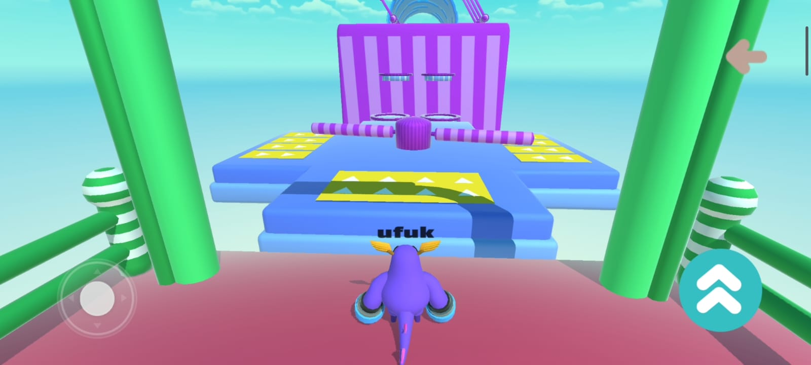

# FLUFFY FALL PARTY

Bu proje unity kullanılarak geliştirilmiş bir 3D platform-macera oyunudur.Oyunda, oyuncular diğer oyuncularla yarışarak bitiş çizgisine ilk ulaşmaya çalışır ve eğlenceli bir rekabet deneyimi yaşar.

## 🎮 Özellikler

**Multiplayer Desteği:** Oyuncular diğer oyuncularla eş zamanlı yarışır. 
**Farklı Parkurlar:** Zorlu ve eğlenceli engellerle dolu birden fazla parkur. 
**Benzersiz Karakterler:** Farklı türlerde benzersiz karakterler.

## 💻 Kullanılan Teknolojiler

  **Unity:** Oyun motoru. 
  **C#:** Oyun kodlaması için kullanılan ana programlama dili. 
  **Firebase:** Kullanıcı verilerini yönetmek için. 
  **Photon PUN:**  Online oyun modunda gerçek zamanlı eşleştirme ve çok oyunculu desteği.

## 📲 Oyunu İndir
   

  ## Ekran Görüntüleri

 
&nbsp;

&nbsp;

&nbsp;

&nbsp;

&nbsp;

